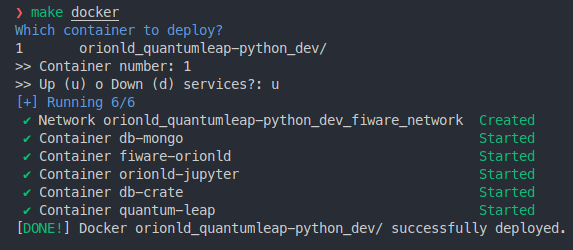
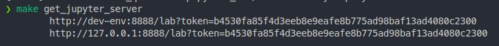
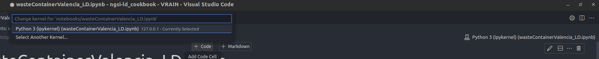
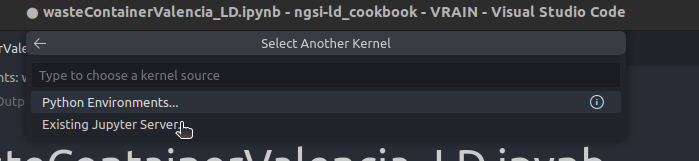
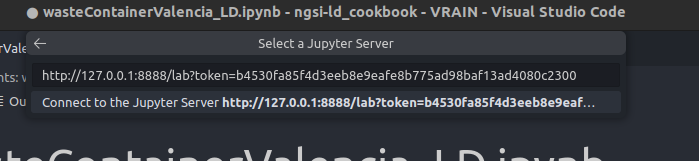
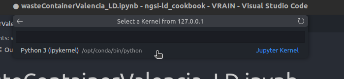
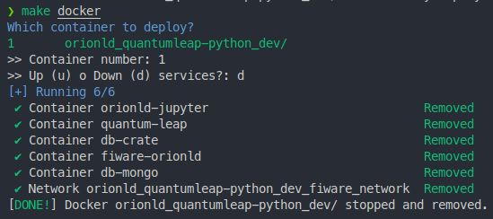

```bash
git submodule init
git submodule update
```

## Deploy all services:

```bash
make docker
```



## Get Jupyter server endpoint:

```bash
make get_jupyter_server
```



Copy the Jupyter server endpoint.

```bash
http://127.0.0.1:8888/?token=...
```

## Jupyter notebook configuration:









## Down all docker services:


